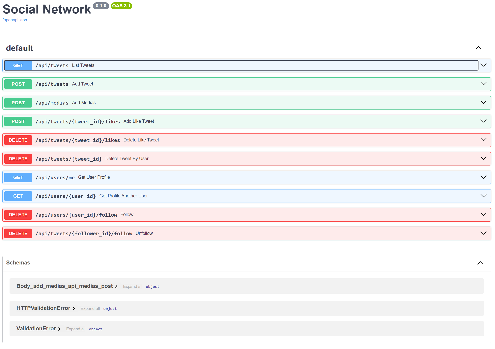
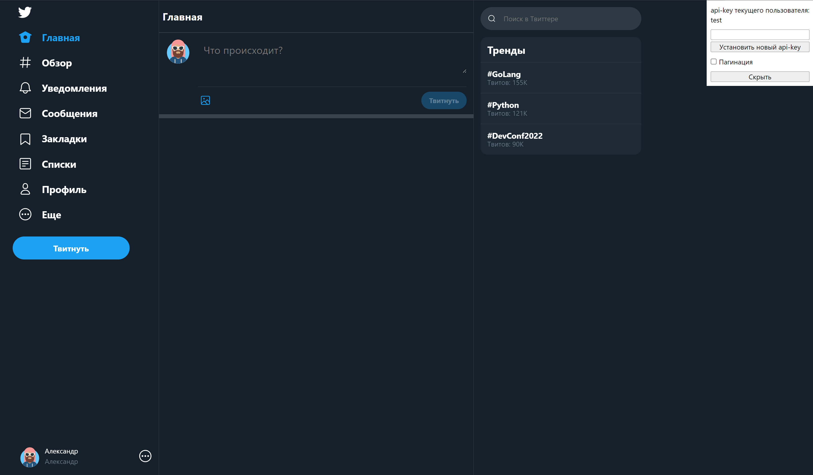

<h1 
style="text-align: center; color: lightblue">
Социальная сеть для комерческого использования "Клон Twitter"
</h1>

<h2 style="color: lightgreen">Для разработчиков:</h2>

### Cтруктура проекта:
1. backend
2. frontend
3. migrations
4. requirements
5. tests
6. docker-compose.yml

### Backend:
Отвечает за backend составляющую приложения. В разделе расписана логика по обработке
запросов пользователей, взаимодействие с БД, конфигурационные настройки и модели данных pydantic.
Весь backend вместе с СУБД postgre можно запустить командой "docker compose up database backend".
Таким образом запустятся два сервиса БД и backend без frontend.
http://localhost:8000/docs - этот адрес откроет интерактивную документацию приложения.

backend написан на фреймворке FastAPi c использованием ORM SqlAlchemy.

**WARNING:** Запуск приложения без БД приведет к ошибке подключения:
 
socket.gaierror: [Errno 11001] getaddrinfo failed. Убедительно рекомендуем запускать backend c БД.
Application startup failed. Exiting.

**WARNING:** Обращение напрямую к эндпоинтам через адресную строку приведет к ошибке.
Чтобы проверить работоспособность backend достаточно зайти по адресу http://localhost:8000/docs 

### frontend:
Отвечает за отображния старниц приложения.

- Основная страница выглядит так

**WARNING:** frontend запустить напрямую можно командой "docker compose up frontend" 
и перейти по адресу http://localhost:80/ 
отобразится основная страница приложения. Все остальные эндпоинты работать не будут.

### migrations:
Отвечает за структуру БД и ее таблиц и полей, в пакете содержатся вся необходимая информация
для изменения удаления или добавления элементов в БД. Управление БД отвечает Alembic.

**WARNING:** при изменении структуры БД в migrations целостность данных не гарантируется.

### requirements:

Этот пакет отвечает за целостность всех установленных зависимостей проекта. 
используется технология Poetry.

### tests:

Тесты приложения:
Тестирование выполненно с использованием pytest и разбито на два модуля:
- test_database.py - Тесты для БД;
- test_endpoints.py - Тесты для ендпоинтов.

При тестировании необходимо выполнить команду "docker compose up" - эта команда поднимит тестовую БД
Потом при необходимости можно протестировать либо отдельную функцию либо отдельный эндпоинт, либо отдельный класс
Либо выполнить тесты разом всей папки tests.

**WARNING:** При тестировнии отдельных функций и эндпоинтов класов TestTweets, и TestRoutersTweets
возможно наблюдать падение тестов которое связано с тем что тесты внутри класса 
взаимодополняют друг-друга. Рекомендуется тестировать Класс одним разом.

**WARNING:** В обязательном порядке при тестировании в первую очередь поднимайте тестовую БД
командой "docker compose up". Иначе все тесты упадут.

### docker-compose.yml

Самый важный файл всего проекта 😊. В этом файле определена вся логика по запуску сервисов
backend, frontend, database. Запуская этот файл запускаем все приложение.
Запустить приложение можно командой "docker compose up"

**IMPORTANT:** Первый запуск приложения может быть долгим, это может быть связано с тем что некоторые
зависимости и образы не существуют на физическом диске вашего компьютера. И docker будет эти зависимости
загружать из docker-hub и потом формировать образ и контейнеры для запуска приложения.

**WARNING:** При запуске файла docker-compose.yaml. Убедитесь что на вашей ОС установлен и коректно работает
Docker.

Остановить приложение можно командой "docker compose down"

<h2 style="color: lightgreen">Для пользователей:</h2>
- Пользователь может отправить Твит 
(В Твите написать сообщение в группу, а также прикрепить выбраное им изображение)
- Пользователь может удалить свой Твит, нажав на три точки в правом верхнем углу.
WARNING: Пользователь может удалить только свой Твит. Твит другого пользователя удалить он не сможет.
- Пользователь может поставить или убрать лайк выбранному Твиту, нажав на сердечко
в левом нижнем углу. Все лайки пользователя поставленные им отображаются красным цветом.
- Пользователь может зайти на страницу другого пользователя кликнув в ленте Твитов
на аватарку.
- Перейдя на профиль пользователя после клика на аватарку 
можно подписаться на него нажав на кнопку "Читать"
- Пользователь на которого подписались может убрать подписку нажав на кнопку "Перестать читать"
- Нажав на кнопку "Профиль" в нижнем левом углу можно перейти на свою страницу.
